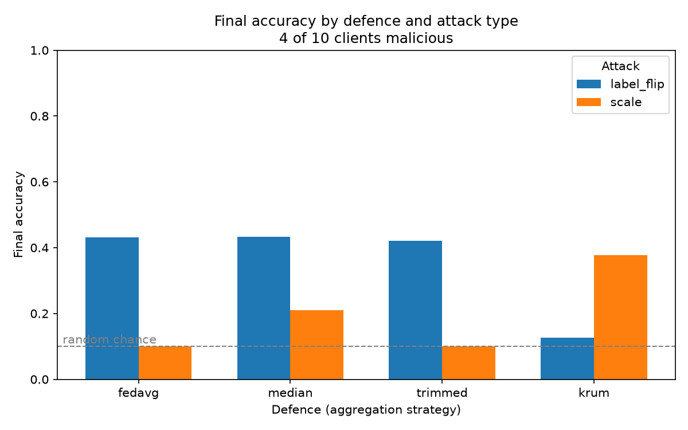
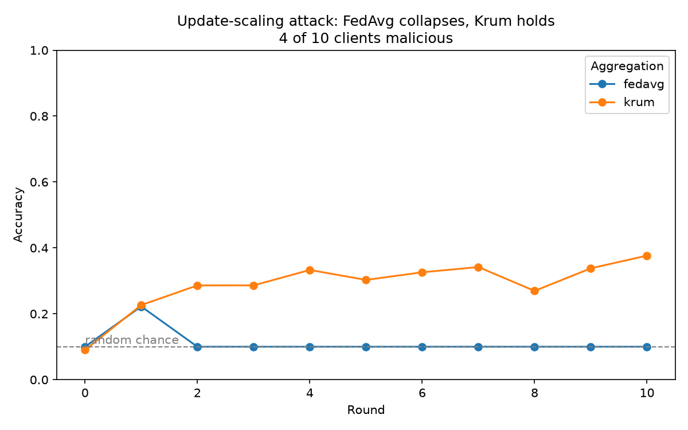

# Federated Learning Security: Poisoning Attacks vs. Robust Defences

A hands-on comparison of how well different "defences" protect federated
learning from malicious clients, built on [Flower](https://flower.ai) +
PyTorch, using the CIFAR-10 image dataset.

## The problem

In federated learning, lots of separate clients (think phones or hospitals)
train a shared model together. Each client trains on its own private data and
sends back only its *update* to the model — never the raw data. The catch: the
central server never sees that data, so it has no easy way to tell an honest
update from a sabotaged one. A malicious client can quietly send a **poisoned**
update to damage the shared model.

The usual way the server combines updates is to simply **average** them
(an approach called *FedAvg*). This project asks a simple question: if a fixed
number of clients turn malicious, does it matter *how* the server combines the
updates? In other words, can a smarter combining rule (a "robust aggregation"
defence) blunt the damage — and does the best defence depend on the *type* of
attack?

## How it works

- **Data and model:** CIFAR-10 (small colour images in 10 categories), split
  evenly across **10 clients**. Each client trains a small convolutional neural
  network (`pytorchexample/task.py`).

- **The two attacks** (`pytorchexample/client_app.py`) — the first
  `num-malicious` clients turn bad:
  - **`label_flip` (a "quiet" attack):** the client trains as normal but on
    *wrong answers* — every label is swapped for its opposite (`9 - label`). The
    update it sends back looks perfectly ordinary; it has just learned the wrong
    thing.
  - **`scale` (a "loud" attack):** the client trains normally, then multiplies
    every number in its update by 10 before sending it — a giant update designed
    to overpower the average.

- **The four defences** (`pytorchexample/server_app.py`), chosen with the
  `aggregation` setting:
  - **`fedavg`** — plain averaging. No defence; our baseline.
  - **`median`** — for each weight, take the *middle* value across clients
    instead of the average, so extreme values get ignored.
  - **`trimmed`** — throw away the most extreme values on each end
    (`beta=0.2`, i.e. the top and bottom 20%), then average the rest.
  - **`krum`** — pick the single update that most *agrees* with the others,
    on the idea that honest clients look alike and liars stand out. It's told
    how many liars to expect (`num_malicious_nodes`).

- **Settings you can change** (in `pyproject.toml`, or override on the command
  line): `num-server-rounds`, `num-malicious`, `attack`, `aggregation`,
  `learning-rate`, `local-epochs`, `batch-size`, `fraction-evaluate`.

## Results

Every experiment below uses **4 of the 10 clients as attackers**, run for 10
rounds. Numbers are the final accuracy of the shared model (higher is better;
**0.10 is random guessing**, since there are 10 categories). A clean, un-attacked
model scores about **0.48**.



*Final accuracy for each defence against each attack (4 of 10 clients malicious).*

| Defence          | `label_flip` (quiet) | `scale` (loud)   |
| ---------------- | -------------------- | ---------------- |
| FedAvg (none)    | 0.43                 | 0.10 *(crashed)* |
| FedMedian        | 0.43                 | 0.21             |
| FedTrimmedAvg    | 0.42                 | 0.10 *(crashed)* |
| Krum             | 0.13                 | 0.38             |

*"crashed" = the model's numbers overflowed to `NaN` (not-a-number) partway
through and never recovered, leaving it stuck at random-guessing accuracy.*

## Findings

**There is no single best defence — the winner flips depending on the attack.**
That's the headline, and it's the whole point.

**Against the loud (`scale`) attack:**
- **FedAvg collapses instantly.** The giant ×10 updates blow the average up so
  badly that the numbers overflow to `NaN` by round 2 — the model is dead.
- **Krum holds up best** (0.38). Because the scaled updates are wildly different
  from everyone else's, Krum spots them as outliers and simply picks an honest
  update instead.
- **FedMedian half-survives** (0.21) — the middle value dodges the worst of the
  giant updates, but not perfectly.
- **FedTrimmedAvg also crashes**, which is the surprising bit — see below.

**Against the quiet (`label_flip`) attack:**
- **FedAvg, FedMedian, and FedTrimmedAvg all cope fine** (~0.42–0.43), barely
  worse than the plain average. The robust defences add almost nothing here.
- **Krum falls apart** (0.13, close to random) — the exact opposite of how it
  did against the loud attack.



*Round by round under the `scale` attack: FedAvg spikes then dies at the
chance line, while Krum climbs and holds.*

The two failures are the most interesting results, and each has a clear reason:

- **Why trimmed mean failed against scaling.** `beta=0.2` throws away only the
  2 highest and 2 lowest values (out of 10). But there were **4 attackers**, so
  a couple of giant values always survived the trim, poisoned the average, and
  blew it up. The lesson: **the amount you trim has to be bigger than the number
  of attackers.** With only 2 attackers it would have coped.

- **Why Krum failed against label-flipping.** Krum works by spotting the update
  that *stands out*. But a label-flipper's update looks completely normal — it's
  just quietly wrong — so there's nothing for Krum to spot. Worse, Krum keeps
  only *one* client's update each round and throws the other nine away, so it
  loses the benefit of averaging entirely, which is why it's so unstable.

**The takeaway:** a defence is only as good as its match to the *specific*
attack. The very thing that makes Krum great against loud attacks (trusting only
the update that stands out) is what makes it terrible against quiet ones. There's
**no free lunch** — no aggregation rule wins across the board.

## Limitations

- One dataset (CIFAR-10) and one small model — results may not carry over to
  other data or larger networks.
- Data is split evenly (IID) across clients; real clients often have skewed,
  uneven data.
- Only two attacks, and both are fixed — no clever attacker that adapts to
  whichever defence is being used.
- Each cell in the table is a single run, not an average over several, so
  expect some run-to-run wobble.
- Krum is *told* the true number of attackers as a setting; the other defences
  get no such help, so the comparison slightly favours Krum.

## Reproduce

Install the project and its dependencies:

```bash
pip install -e .
```

Run one (attack, defence) combination — e.g. Krum against the scaling attack
with 4 of 10 clients malicious:

```bash
flwr run . --run-config 'num-server-rounds=10 num-malicious=4 attack="scale" aggregation="krum"' --stream
```

Swap `attack` between `"label_flip"` / `"scale"`, and `aggregation` between
`"fedavg"` / `"median"` / `"trimmed"` / `"krum"`, to reproduce every cell in the
table. The `--stream` flag prints each round's accuracy live in your terminal.
(The dataset downloads automatically on the first run.)

Once `results.csv` (final accuracy per attack/defence) and `training_curves.csv`
(per-round accuracy and loss) are filled in, regenerate the figures with:

```bash
python plot_results.py         # -> results.png
python plot_collapse_curve.py  # -> collapse_curve.png
```